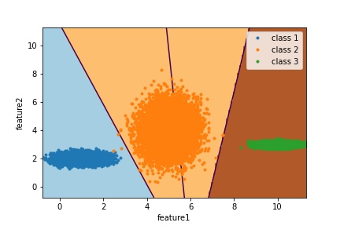
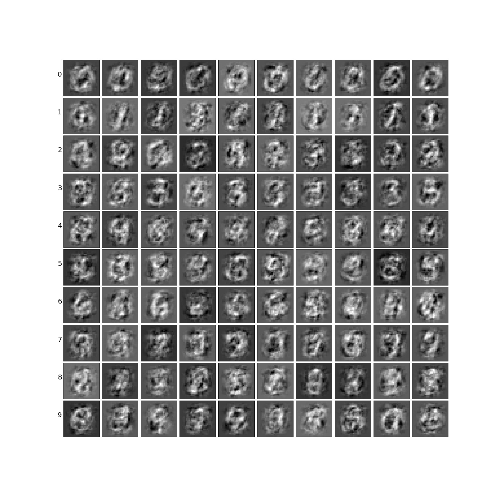

# LinearDiscriminantAnalysis

Implementation of Linear Discriminant Analysis. 

### Tested on:
1. Toy Dataset - 99 ~ 100% accuracy
2. MNIST Dataset - 85 ~ 88% accuracy

### Decision boundary of toy dataset

The decision boundary is linear, thus the name Linear Discriminant Analysis.

### Samples generated:

The samples generated contain many noise because LDA assume same covariance for every class. Thus the estimated covariance cannnot exactly represent the covariance for each class. Looking in the image cloaser, we still can see outline of digits in some images. 

### Todo:
1. Add formula used in readme.md
